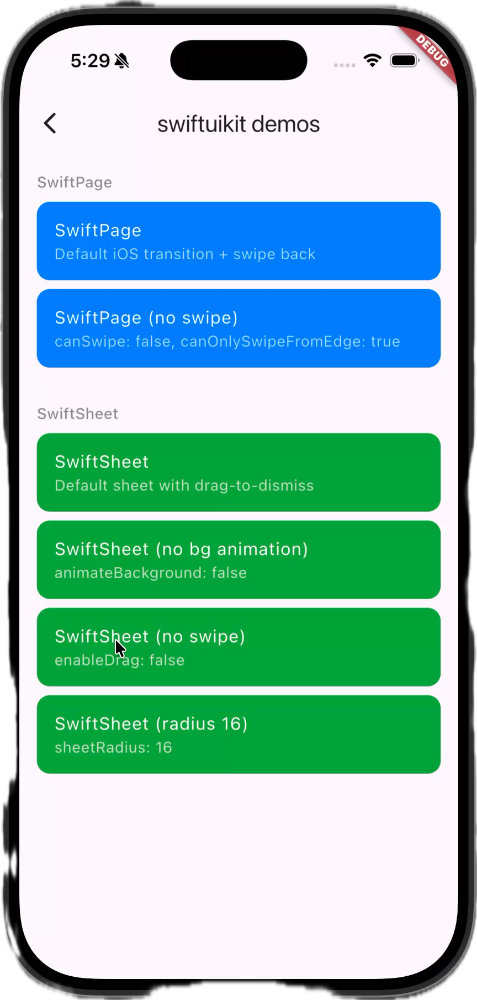

# swiftuikit

iOS-style page transitions and sheet routes for Flutter.

<p align="center">
  
  
  
</p>

Provides two routing adapters: **go_router / Navigator 2.0** and **auto_route**.

## Quick start

**pub.dev:**

```yaml
dependencies:
  swiftuikit: ^latest
```

**GitHub (latest):**

```yaml
dependencies:
  swiftuikit:
    git:
      url: https://github.com/exeshka/swiftuikit
```

## Setup

Call `ScreenRadiusService.instance.initialize()` before `runApp()` to enable device-aware corner radius clipping:

```dart
void main() async {
  WidgetsFlutterBinding.ensureInitialized();
  await ScreenRadiusService.instance.initialize();
  runApp(MyApp());
}
```

## Route types

| Route | Description |
|-------|-------------|
| `SwiftPage` / `SwiftPageAutoRoute` | Full-screen page with iOS swipe-back gesture and parallax/scale transition |
| `SwiftInteractiveZoomPage` / `SwiftInteractiveZoomAutoRoute` | Gesture-driven card-to-page zoom transition with runtime source IDs |
| `SwiftSheetPage` / `SwiftSheetAutoRoute` | Modal bottom sheet with drag-to-dismiss |

## Usage with go_router

Use the page classes in a `pageBuilder`:

```dart
GoRoute(
  path: '/detail',
  pageBuilder: (context, state) {
    return SwiftPage<void>(
      key: state.pageKey,
      name: state.name,
      child: DetailScreen(),
    );
  },
);

GoRoute(
  path: '/compose',
  pageBuilder: (context, state) {
    return SwiftSheetPage<void>(
      key: state.pageKey,
      child: ComposeScreen(),
    );
  },
);
```

## Usage with auto_route

Use the auto route classes in your `@AutoRouterConfig`:

```dart
@AutoRouterConfig(replaceInRouteName: 'Screen|Page,Route')
class AppRouter extends RootStackRouter {
  @override
  List<AutoRoute> get routes => [
    SwiftPageAutoRoute(page: HomeRoute.page, initial: true),
    SwiftPageAutoRoute(page: DetailRoute.page),
    SwiftSheetAutoRoute(
      page: SheetRoute.page,
      showDragHandle: true,
      animateBackground: true,
    ),
  ];
}
```

Run codegen from the `example/` directory:

```bash
cd example && dart run build_runner build --delete-conflicting-outputs
```

## SwiftPage / SwiftPageAutoRoute

Full-screen page transition with iOS-style swipe-back gesture.

```dart
SwiftPage<void>(
  child: MyScreen(),
  canSwipe: true,              // enable swipe-back gesture (default: true)
  canOnlySwipeFromEdge: false, // restrict swipe to screen edge (default: false)
  minScale: 0.95,              // scale of the outgoing page during push (default: 0.95)
  transitionDuration: Duration(milliseconds: 500),
)
```

| Property | Type | Default | Description |
|----------|------|---------|-------------|
| `canSwipe` | `bool` | `true` | Enable swipe-back gesture |
| `canOnlySwipeFromEdge` | `bool` | `false` | Restrict swipe detection to the screen edge |
| `minScale` | `double` | `0.95` | Scale of the outgoing page during a push transition |
| `pageOverlapFraction` | `double` | `0.40` | How much the incoming page overlaps the outgoing page |
| `clipWithScreenRadius` | `bool` | `true` | Clip with physical device screen corners |
| `radius` | `double?` | — | Custom corner radius |
| `borderRadius` | `BorderRadius?` | — | Custom border radius geometry |
| `transitionDuration` | `Duration` | `500ms` | Transition animation duration |

## SwiftInteractiveZoom

`SwiftInteractiveZoomRoute` is a standalone transition. It owns both the zoom
animation and interactive swipe-back, so it does not affect `SwiftPage` or any
other route type. Mark the opening card or image with
`SwiftInteractiveZoomSource` and pass its stable ID to the route. Wrap the
source page in `SwiftInteractiveZoomBackground` to make that page scale and
use the device corner radius while the zoom route is active.

```dart
SwiftInteractiveZoomBackground(
  child: Scaffold(
    body: SwiftInteractiveZoomSource(
      id: product.id,
      child: ProductCard(
        product: product,
        onTap: () => Navigator.of(context).push(
          SwiftInteractiveZoomRoute<void>(
            sourceId: product.id,
            builder: (_) => ProductScreen(product: product),
          ),
        ),
      ),
    ),
  ),
)
```

The source is resolved again when the route closes, so use model IDs rather
than a stored `BuildContext` or list index. The route supports pan-to-dismiss
in any direction; set `canOnlySwipeFromEdge: true` to restrict its start to the
leading screen edge.

With `go_router`, read the same ID that was used to build the destination
screen and pass it to `SwiftInteractiveZoomPage`:

```dart
GoRoute(
  path: '/products/:productId',
  pageBuilder: (context, state) {
    final productId = state.pathParameters['productId']!;
    return SwiftInteractiveZoomPage<void>(
      key: state.pageKey,
      sourceId: productId,
      child: ProductScreen(productId: productId),
    );
  },
)
```

With `auto_route`, resolve the ID from the generated runtime arguments. The
route declaration remains static while every pushed product gets its own Hero
tag:

```dart
SwiftInteractiveZoomAutoRoute(
  page: ProductRoute.page,
  sourceIdResolver: (data) =>
      data.argsAs<ProductRouteArgs>().productId,
)

context.router.push(ProductRoute(productId: product.id));
```

In both cases the source uses that same value:

```dart
SwiftInteractiveZoomSource(
  id: product.id,
  child: ProductCard(product: product),
)
```

## SwiftSheetPage / SwiftSheetAutoRoute

Modal bottom sheet with drag-to-dismiss.

```dart
SwiftSheetPage<void>(
  child: ComposeScreen(),
  showDragHandle: true,     // show drag indicator at the top (default: false)
  enableDrag: true,         // allow drag-to-dismiss (default: true)
  dismissThreshold: 0.32,   // dismiss after dragging 32% of the sheet
  minFlingVelocity: 1.0,    // sheet heights per second
  animateBackground: true,  // animate the previous page (default: true)
  preserveTopSafeArea: true, // keep system top inset and open at full height
  sheetRadius: 38.0,        // corner radius
)
```

| Property | Type | Default | Description |
|----------|------|---------|-------------|
| `showDragHandle` | `bool` | `false` | Show a drag handle indicator at the top of the sheet |
| `enableDrag` | `bool` | `true` | Allow drag-to-dismiss gesture |
| `dismissThreshold` | `double` | `0.32` | Fraction of sheet height required to dismiss |
| `minFlingVelocity` | `double` | `1.0` | Downward fling velocity required to dismiss, in sheet heights per second |
| `animateBackground` | `bool` | `true` | Animate (scale, slide, round corners of) the previous page when the sheet appears |
| `preserveTopSafeArea` | `bool` | `false` | Keep the system top inset and open the sheet at 100% screen height |
| `sheetRadius` | `double?` | — | Corner radius of the sheet |
| `sheetBorderRadius` | `BorderRadius?` | — | Custom border radius geometry for the sheet |
| `transitionDuration` | `Duration` | `500ms` | Transition animation duration |

When `preserveTopSafeArea` is enabled, the current sheet and the route behind
it use the physical screen radius from `ScreenRadiusService` by default.
An explicit `sheetBorderRadius` or `sheetRadius` takes priority and is applied
to both routes.

## Roadmap

What's planned for future releases:

- **Sheets & modals from SwiftUI 26** — pull-down menus, confirmation sheets, and other presentation styles currently available in native SwiftUI. Note: Liquid Glass implementations in the Flutter community are not production-ready for these use cases. We're waiting for the Flutter team to provide proper support.

- **SwiftUI components without Liquid Glass** — Header, Bottom Navigation Bar, and other UI elements that can be reliably implemented today.

We're hoping for community contributions to help close the gap between what Flutter offers natively and what SwiftUI provides out of the box.

## License

See [LICENSE](LICENSE) for details.
